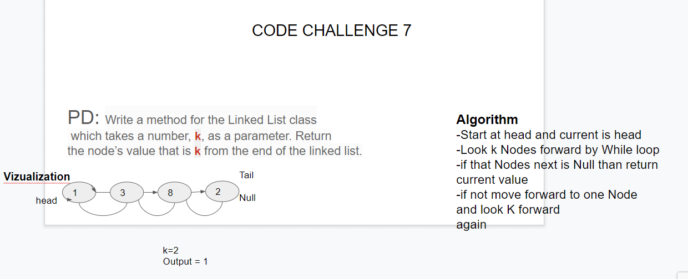

Challenge 06
##Add an append  to LinkedList class that takes a value and adds it at the end of the Linked List.

##Add an insertBefore method to  LinkedList class that takes in a value and newValue, and inserts a new Node 
before the Node that contains the given value.

##Add an insertAfter method to  LinkedList class that takes in a value and newValue, and inserts a new Node after
 the Node that contains the given value.

Challenge 07

##Challenge
Write a method for your LinkedList class that takes in an integer k and returns the value from the kth node from the end of the list.

##Approach and Efficiency
The approach for this method was to start by looking at the head of the list, and then look k nodes forward from there and see if the next value of that node is null. If that node k away from the current has a next value of null then it will return the value from the current node. If not, then the current node will be set to the next in the list until either the proper node is found or the function has to throw an error due to being out of the bounds of the list. The time of this method is O(n) and the space is O(1).

